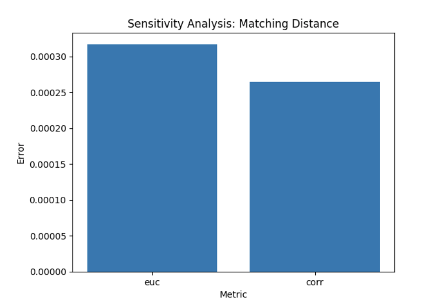

# Image Stitching in Python

This project follows the objective of stitching two images together in order to create a panoramic image based on keypoint matching.

In this report, the matching keypoints are found through the application of a distance metric between the key points of the left image and the right image. By thresholding this distance to only return keypoints that achieve a distance lower than the threshold, we can make sure that we have somewhat robust set of matches.

We further optimize this set of keypoints by applying RANSAC with various error thresholds and sample sizes. This leads us to the calculation of our Homography matrix which is used for the image transformation.

All reported values for sensitivity analysis are average values for 5 -10 iterations. This was done to smooth out the randomness effect of the RANSAC algorithm.

## Matching Keypoint Detection

The above image depicts all the key points found by the SIFT algorithm. The next step was to extract the key points that are a match between both images. This filtering occured in two steps. Through thresholding a distance metric between descriptors and through the application of RANSAC, for which the latter will be covered in a subsequent section.

## Keypoint Matching
For each keypoint descriptor in the first image, the closest descriptor on the second image was extracted. This returned a set of matching keypoints, which was then reduced by dropping any matches that did not fall within a minimum distance. Two distance metrics were tested, the euclidean distance and the normalized correlation metric.

The two metrics performed similarly, however, the normalized correlation metric had a significantly higher computation time through it’s slightly more complex calculation.

For this reason this report makes use of the euclidean distance as a baseline for other sensitivity analysis.

## Extracting Robust Matches
In order to extract to minimize the number of false positive matches, only those that fall within a minimum distance threshold are selected.

It is interesting to see how a larger threshold actually yielded a lower error on average. We hypothesize that this is due to the fact that RANSAC is better at selecting matches as opposed to the distance heuristic. Thus, by leaving more points to RANSAC, the selection turns out to be better.

## RANSAC

The RANSAC algorithm depended mainly on two parameters, sample size and error threshold.

The sample size refers to the number of match points to extract for each RANSAC iteration. A guideline is to use a sample size of more than 3 to lessen the risk of having a far from correct transformation.

We see in Fig 5 that the optimal sample sizes are between 4 and 10. Any higher and we start overfitting the RANSAC model. Figure 6 depicts the relationship between the error threshold and the final error. THere seems to be a positive correlation, a higher threshold returns a worse performance. However, if the threshold is too small then the performance is bad again as there aren’t enough keypoints.

### Key Points before RANSAC
Here we see the key points before RANSAC is run. Purely through visual inspection one can recognize that many keypoints are not shared by both images.

Key Points after RANSAC (Inliers)
In the below image we can clearly see how the RANSAC algorithm cut out the outliers. In the second set of images we see that there are hardly any key points left that are not mutually shared by both halves. This is an indication that out RANSAC algorithm did a good job in detecting and cutting out outliers.

## Keypoint Extraction
The first task of this assignment was to find the matching keypoints between the two image halves. Although the Harris corner detection algorithm was recommended, SIFT was implemented for this assignment as it returned more robust keypoints.

## Final Implementation

PLEASE NOTE: Distance and error thresholds are iteratively adjusted in our program to achieve optimal results.

Budapest
Distance metric threshold: 0.00021474836480000014
RANSAC error threshold: 2.7886874914558863e-07
Number of Inliers: 634
Number of Outliers: 3296
Average Inlier Residual: ~1195

# Running the code

Please open the main.py file. There on lines 17 and 18 the paths to the left and right images to
be stitched can be inserted. Once done, navigate to the directory in which the python scripts
are located and run main.py

This will give statistical output in the terminal and return the panorama image.

Several intermediate step images will be saved in the working directory, including the final panorama.

# Libraries Required

Please note that, because SIFT is a patented algorithm, the normal OpenCV library does not include it.
You will need to install the opencv_contrib library, which is made for academia.

Ubuntu install: pip3 install opencv-contrib-python

opencv
matplotlib
numpy
sklearn
scipy
